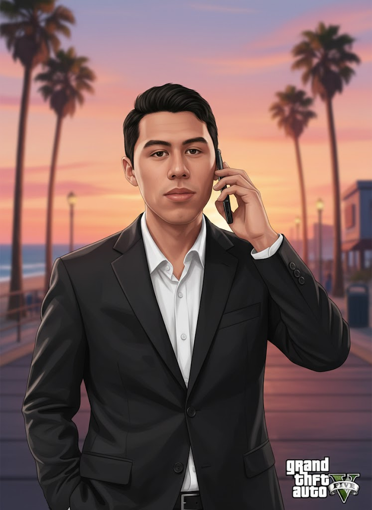

# (Call) GTA V Loading Screen Artwork Generation

## Overview

This document contains the prompt engineering workflow and results for generating a Grand Theft Auto V loading screen artwork using AI image generation tools.

## Primary Generation Prompt

### Gemini Nano Prompt

```markdown
Use the provided photo as the exact face reference and preserve the same identity and facial features.

Transform the image into a realistic Grand Theft Auto V in-game loading screen artwork style.
Waist-up framing only, cropped at the waist, no legs visible.

Place the character slightly on the left side of the frame,
naturally holding a smartphone to the ear as if calmly talking on a call,
relaxed confident posture, subtle calm expression, not stiff.

Cinematic Rockstar-style lighting with smooth stylized shading,
realistic 3D in-game character textures and vibrant color grading.

Background: blurred Los Santos beach walk with palm trees,
warm sunset tones, soft ocean light, atmospheric depth of field,
authentic GTA V loading screen composition.

Keep the facial likeness extremely accurate and do not alter identity.
High detail, sharp focus on face, professional poster quality.
```

<h3>Paste Prompt turn on Nano Banana and turn on Thinking mode</h3>
<div align="center">

</div>

### Initial Result

The first generation produced a GTA V loading screen artwork that captures the character's likeness while maintaining the distinctive game aesthetic.

<div align="center">

</div>

## Resolution Enhancement

### Follow-up Prompt (ChatGPT Image Generation)

<h4> Paste the generated nano image into ChatGPT and turn on image generation, then pasto the following prompt to enhance the resolution </h4>
<div align="center">

</div>

To improve the image quality and resolution for better display purposes:

```markdown
do it 1920x1080
```

### Enhanced Result

The resolution enhancement resulted in a high-definition version of the loading screen artwork, optimized for 1080p displays.


## Technical Specifications

- **Original Resolution**: Standard quality
- **Enhanced Resolution**: 1920x1080 (Full HD)
- **Style**: Grand Theft Auto V in-game loading screen artwork
- **Framing**: Waist-up composition, cropped at the waist
- **Pose**: Character holding smartphone to ear, relaxed confident posture
- **Background**: Blurred Los Santos beach walk with palm trees
- **Lighting**: Cinematic Rockstar-style with smooth stylized shading
- **Quality**: High detail, sharp focus on face, professional poster quality

## Generation Tools Used

1. **Gemini Nano** - Primary image generation
2. **ChatGPT Image Generation** - Resolution enhancement

## Notes

- The character's facial features and identity are preserved throughout the generation process
- The artwork maintains the distinctive GTA V loading screen composition and aesthetic
- Both standard and high-resolution versions are available for different use cases
- Background features warm sunset tones and soft ocean light for atmospheric depth
