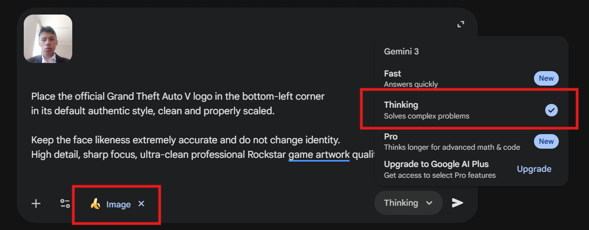
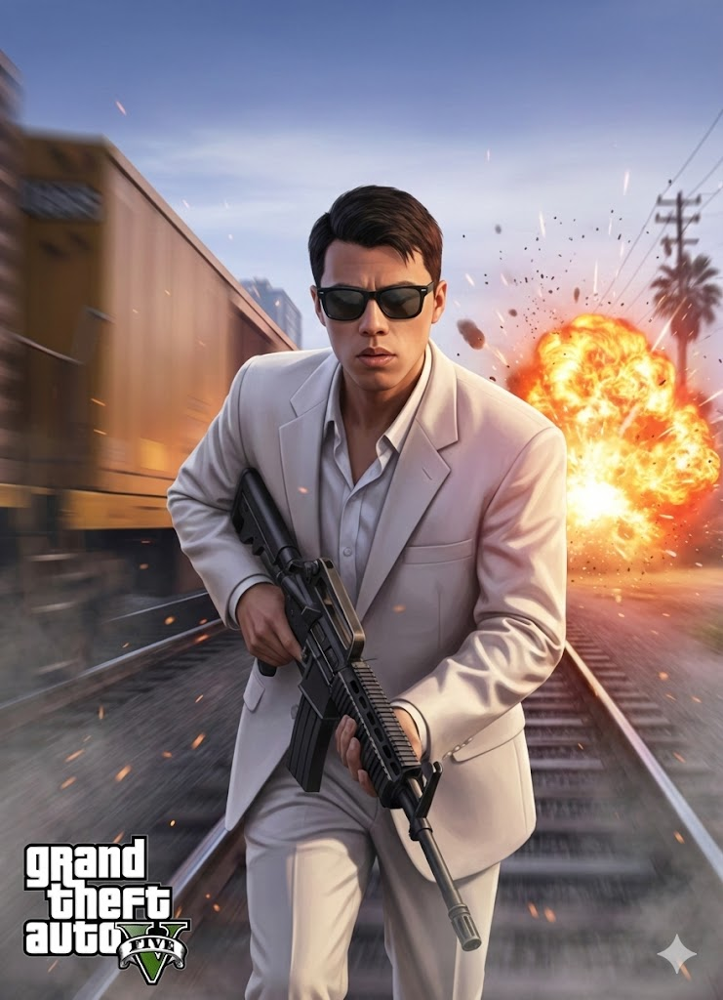
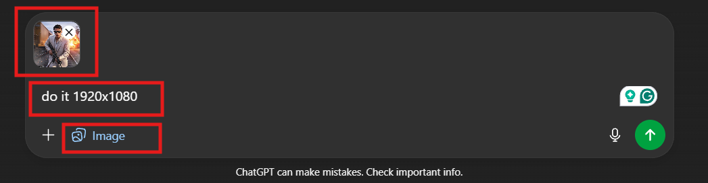

# (Run) GTA V Loading Screen Artwork Generation

## Overview

This document contains the prompt engineering workflow and results for generating a Grand Theft Auto V loading screen artwork using AI image generation tools.

## Primary Generation Prompt

### Gemini Nano Prompt

```markdown
Use the provided photo as the exact face reference and preserve the same identity and facial features.

Turn this photo into a realistic Grand Theft Auto V in-game artwork style.
Waist-up framing only, cropped at the waist, no legs visible.

Place the character slightly further to the left side of the frame,
running forward toward the viewer in a dynamic cinematic action pose,
wearing a light white/cream suit with an open collar shirt,
black sunglasses added in authentic GTA V character style,
holding a rifle in a unique natural moving grip angled downward,
focused, calm but determined expression, natural motion energy, not stiff.

Add a dramatic Los Santos railway background with a blurred yellow train
and a large fiery explosion behind on the tracks,
strong depth of field, heat glow, smoke particles, cinematic action atmosphere.

Cinematic Rockstar Games lighting, smooth stylized shading,
realistic 3D in-game character textures, vibrant environmental blur,
official GTA V loading screen composition and color grading.

Place the official Grand Theft Auto V logo in the bottom-left corner
in its default authentic style, clean and properly scaled.

Keep the face likeness extremely accurate and do not change identity.
High detail, sharp focus, ultra-clean professional Rockstar game artwork quality.
```

<h3>Paste Prompt turn on Nano Banana and turn on Thinking mode</h3>
<div align="center">

</div>

### Initial Result

The first generation produced a GTA V loading screen artwork that captures the character's likeness while maintaining the distinctive game aesthetic.

<div align="center">

</div>

## Resolution Enhancement

### Follow-up Prompt (ChatGPT Image Generation)

<h4> Paste the generated nano image into ChatGPT and turn on image generation, then pasto the following prompt to enhance the resolution </h4>
<div align="center">

</div>

To improve the image quality and resolution for better display purposes:

```markdown
do it 1920x1080
```

### Enhanced Result

The resolution enhancement resulted in a high-definition version of the loading screen artwork, optimized for 1080p displays.


## Technical Specifications

- **Original Resolution**: Standard quality
- **Enhanced Resolution**: 1920x1080 (Full HD)
- **Style**: Grand Theft Auto V in-game loading screen artwork
- **Framing**: Waist-up composition, cropped at the waist
- **Pose**: Character holding smartphone to ear, relaxed confident posture
- **Background**: Blurred Los Santos beach walk with palm trees
- **Lighting**: Cinematic Rockstar-style with smooth stylized shading
- **Quality**: High detail, sharp focus on face, professional poster quality

## Generation Tools Used

1. **Gemini Nano** - Primary image generation
2. **ChatGPT Image Generation** - Resolution enhancement

## Notes

- The character's facial features and identity are preserved throughout the generation process
- The artwork maintains the distinctive GTA V loading screen composition and aesthetic
- Both standard and high-resolution versions are available for different use cases
- Background features warm sunset tones and soft ocean light for atmospheric depth
